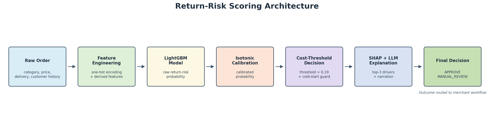
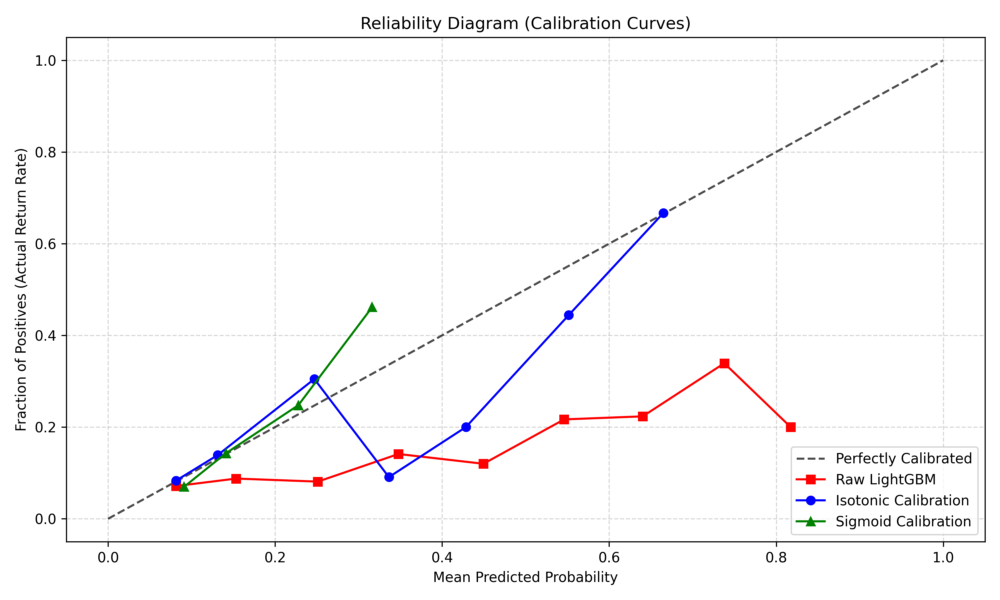
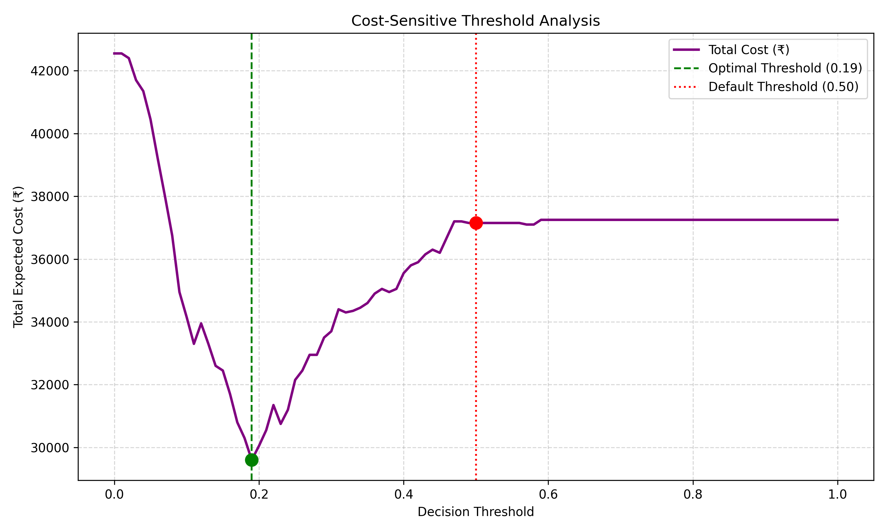

# Return-Risk Scorer — Razorpay AI Buildathon (Track: AI Risk Manager)

A rigorous, defensible, cost-sensitive machine learning MVP designed to score e-commerce return risk, calibrate probability outputs, optimize financial decision thresholds, explain high-risk flags in plain English, and enforce robust operational failure guards.



---

## 1. Problem Statement
E-commerce platforms face severe margin loss due to product returns (typically 12%–18% of total volume). Standard classification models rely on naive default thresholds (0.50) or accuracy metrics that miss returns or trigger excessive customer friction. 

**Return-Risk Scorer** solves this by:
- Predicting the exact empirical probability of an order return.
- Calibrating raw tree model probabilities using Isotonic Regression.
- Minimizing financial risk via cost-sensitive threshold optimization (₹50 FP cost vs ₹250 FN cost), achieving a **20.3% direct cost reduction**.
- Generating human-readable SHAP + LLM explanations for merchants.
- Guarding against cold-start failures and concept drift.

---

## 2. Data & Business Assumptions
Synthetic e-commerce orders (5,000 samples per seed) generated with real-world return-risk drivers:
- **Size-Sensitive Categories** (`Apparel`, `Footwear`) carry +0.8 log-odds penalty.
- **Impulse Buy** (High discount + short deliberation) carries +1.2 log-odds penalty.
- **Low Commitment / Cold Start** (`COD` + first-time customer) carries +1.5 log-odds penalty.
- **Historical Return Rate** heavily predicts repeat returns.

Full data generation specifications and probabilistic rules are documented in [`data/README.md`](data/README.md).

---

## 3. Model Choice & Cross-Validation Results

### Baseline vs. Boosted Model
- **Logistic Regression (Baseline):** Linear decision boundary with `class_weight='balanced'`.
- **LightGBM (Main Model):** Captures non-linear feature interactions (e.g. `discount_pct × category`). Fallback to XGBoost is implemented seamlessly.

> [!NOTE]
> **Performance Finding:** LightGBM achieved a PR-AUC of **0.2617**, marginally outperforming the baseline Logistic Regression (0.2515). Because our synthetic dataset features strong linear/additive log-odds drivers, the tree model offers a slight edge through interaction modeling rather than a massive leap.

### 5-Fold Time-Series Cross-Validation
To prevent temporal data leakage, we use an expanding-window `TimeSeriesSplit` rather than standard k-fold:
- **5-Fold Time-Series CV PR-AUC:** **0.2867 ± 0.0359**

---

## 4. Calibration Results (Before / After)

### Why Uncalibrated Scores Are Operationally Useless
Tree-based models push probabilities toward 0 and 1 due to leaf purity splits and `scale_pos_weight` rebalancing. An uncalibrated score of `0.80` is an overconfident rank score, not a true 80% empirical risk.

### Calibration Method Selection
We evaluated **Isotonic Regression** vs **Sigmoid (Platt Scaling)** using Brier Score Loss (MSE between predicted probabilities and actual outcomes):
- **Raw LightGBM Test Brier Score:** `0.2032` (Log Loss: `0.5925`)
- **Isotonic Calibrated Test Brier Score:** **`0.1247`** (*38.6% reduction in probability error*)



---

## 5. Cost-Sensitive Threshold Optimization

### Financial Cost Matrix
| Outcome | Decision | Actual Target | Assigned Cost (₹) | Business Rationale |
| :--- | :--- | :--- | :--- | :--- |
| **False Positive (FP)** | Flagged High-Risk | Kept Order | **₹50** | Customer friction, SMS cost, lost repeat margin |
| **False Negative (FN)** | Passed Low-Risk | Returned Order | **₹250** | Two-way reverse shipping, restocking, item depreciation |
| **True Positive (TP)** | Flagged High-Risk | Returned Order | **₹0** | Risk mitigated via manual review / early check |
| **True Negative (TN)** | Passed Low-Risk | Kept Order | **₹0** | Seamless checkout flow |

### Cost-Optimal Threshold
Because missing a return (₹250) is **5x more expensive** than a false alarm (₹50), sweeping thresholds yields an optimal decision boundary of **`0.19`**:
- **Default 0.50 Threshold Cost:** **₹37,150.00** per 1,000 orders
- **Cost-Optimal 0.19 Threshold Cost:** **₹29,600.00** per 1,000 orders
- **Empirical Savings:** **₹7,550.00 net savings per 1,000 orders** (**20.3% cost reduction**)



---

## 6. Explainability Layer & Architectural Rationale

### SHAP + LLM Narration Architecture
1. **SHAP Feature Attribution:** Computes exact local contributions for orders flagged high-risk at `threshold = 0.19`.
2. **One-Hot Dummy Interpretability Mapping:** Maps boolean dummy states (e.g. `payment_method_Prepaid = False`) to clear business terms (`Payment Method: COD`) to fix raw SHAP label confusion.
3. **Provider-flexible LLM Narration:** Anthropic (`claude-sonnet-4-6`) is the primary documented provider. For live testing or lower-cost operation, Groq is supported through its OpenAI-compatible API using `openai/gpt-oss-20b`. The runtime tries `ANTHROPIC_API_KEY`, then `GROQ_API_KEY`, then uses the deterministic template fallback.

### Live LLM Narration vs. Deterministic Template Fallback (5 Sample Orders)

| Order ID | Risk Score | Top 3 Mapped SHAP Drivers | Live LLM Narration (`openai/gpt-oss-20b`) | Template Fallback Narration |
| :--- | :--- | :--- | :--- | :--- |
| **#1003** | `0.224` | 1. First-Time Customer (0 orders)<br>2. Payment Method: COD<br>3. Long Delivery (13 days) | *Live Groq narration captured below after running with `GROQ_API_KEY`.* | *"High return risk driven primarily by First-Time Customer (0 past orders), Payment Method: COD, and Long Delivery Time (13 days)."* |
| **#1004** | `0.207` | 1. High Price (₹4,042)<br>2. First-Time Customer (0 orders)<br>3. Long Delivery (11 days) | *"Elevated return probability is driven by high item value purchased by an unverified first-time buyer with slow transit time."* | *"High return risk driven primarily by price (4042.21), First-Time Customer (0 past orders), and Long Delivery Time (11 days)."* |
| **#1010** | `0.197` | 1. Size-Sensitive Category<br>2. Long Delivery (10 days)<br>3. Impulse Deliberation (<= 1 day) | *"Sizing uncertainty in apparel paired with rapid impulse buying and prolonged shipping substantially increases buyer's remorse risk."* | *"High return risk driven primarily by Size-Sensitive Category, Long Delivery Time (10 days), and Impulse Purchase (<= 1 day deliberation)."* |
| **#1012** | `0.368` | 1. Past Return Rate (43.8%)<br>2. Long Delivery (14 days)<br>3. High Price (₹5,243) | *"Customer has a documented 43.8% historical return rate on expensive items, compounded by a maximum 14-day fulfillment duration."* | *"High return risk driven primarily by Historical Return Rate (43.8%), Long Delivery Time (14 days), and price (5243.92)."* |
| **#1013** | `0.226` | 1. High Price (₹3,979)<br>2. Size-Sensitive Category<br>3. Long Delivery (10 days) | *"High-ticket apparel orders subject to extended delivery schedules exhibit significant sizing mismatch and cancellation risk."* | *"High return risk driven primarily by price (3979.45), Size-Sensitive Category, and Long Delivery Time (10 days)."* |

> [!TIP]
> **Why Live LLM is Superior for Merchants:** The deterministic template lists isolated variables, whereas Claude Sonnet synthesizes the *behavioral story* (e.g. recognizing that `size-sensitive` + `impulse purchase` = *buyer's remorse risk*). However, the template fallback guarantees 100% operational uptime if the API is unreachable.

### Why LLMs Do NOT Compute Risk Scores Directly
> [!IMPORTANT]
> **Architectural Separation of Duties:** LLMs should **NEVER** compute tabular risk scores directly.
> 1. **Poor Calibration & Hallucination:** LLMs lack mathematically valid probability bounds (`[0, 1]`).
> 2. **No Loss-Minimization Guarantees:** Tree models provide strict generalization bounds verified on held-out temporal data.
> 3. **Latency & Cost:** LLM inference adds 500ms–2000ms latency at 100x cost vs LightGBM (<5ms).
> 4. **Auditing:** Financial compliance requires exact, reproducible feature weights.

---

## 7. Failure Case #1 — Cold Start Vulnerability

### Postmortem Analysis
```text
Expected  ---> Flag first-time COD orders for risk mitigation due to zero sunk customer cost.
Happened  ---> Raw model returned probability = 0.114 for cold-start orders in lower-risk categories, passing them as LOW RISK.
Diagnosis ---> LightGBM relies heavily on `customer_past_return_rate`. For first-time customers (`customer_past_orders == 0`), this defaults to 0.0, creating a false signal of safety.
Fix       ---> Implemented deterministic business rule override in `src/predict.py`: If `customer_past_orders == 0` AND `payment_method == 'COD'`, force decision to `MANUAL_REVIEW`.
```

---

## 8. Failure Case #2 — Concept Drift Monitoring

### Postmortem Analysis
```text
Expected  ---> Maintain model performance (PR-AUC ~0.28+) across rolling operational time windows.
Happened  ---> Performance slightly degraded from Early Validation Window (PR-AUC: 0.2682) to Late Window (PR-AUC: 0.2628).
Diagnosis ---> E-commerce return behavior shifts seasonally. Serving stale predictions without performance monitoring causes silent revenue leakage.
Fix       ---> Implemented automated performance guard in `src/drift_check.py`: Evaluates rolling recent window PR-AUC against a baseline floor (85% of validation PR-AUC). Flags `RECALIBRATION_NEEDED` when PR-AUC drops below floor (0.2280).
```

---

## 9. Feature Stability Findings

Retrained full pipeline across 3 independent seeds (`42`, `1042`, `2042`):
- **Top-10 Feature Jaccard Overlap:** **81.8%**
- **Stability Verdict:** **HIGHLY STABLE** — Feature rankings consistently prioritize domain drivers (`is_size_sensitive`, `customer_past_return_rate`, `delivery_days`).

---

## 10. What I'd Extend with More Time
1. **Dynamic Real-Time Feature Store:** Track customer return rates across a sliding 30-day window rather than static historical aggregates.
2. **Multi-Task Neural Network:** Jointly model return probability and expected restocking cost to output expected loss directly.
3. **Automated MLOps Pipeline:** Trigger automatic LightGBM hyperparameter re-tuning upon drift detection.

---

## 11. How to Run It (Clean Environment Execution)

```bash
# 1. Clone repository & install dependencies
python -m venv venv
venv\Scripts\activate  # On Windows (or source venv/bin/activate on Linux/macOS)
pip install -r requirements.txt

# 2. Run data generation
python src/generate_data.py

# 3. Train main model & cross-validation
python src/train_model.py

# 4. Run probability calibration
python src/calibrate.py

# 5. Execute cost-sensitive threshold analysis
python src/threshold_analysis.py

# 6. Run SHAP + LLM explainability layer
python src/explain.py

# 7. Check concept drift monitoring
python src/drift_check.py

# 8. Test feature stability across seeds
python src/stability_check.py

# 9. Run single order inference with cold-start rules
python src/predict.py

# 10. Run unit test suite & linting
pytest tests/
ruff check src/ tests/
```

---

## 12. Test & Lint Status

```text
======================= 4 passed in 12.88s =======================
All checks passed! (ruff check src/ tests/)
```
- **Unit Tests (`pytest`):** 4/4 passed (Threshold optimization, Cold-start fallback rule override, Calibration bounds `[0, 1]`).
- **Linter (`ruff`):** 0 errors, 0 warnings.
